# Results

## 1. Classical Baseline (Markowitz)

**Diversification Trend (λ sweep)**:

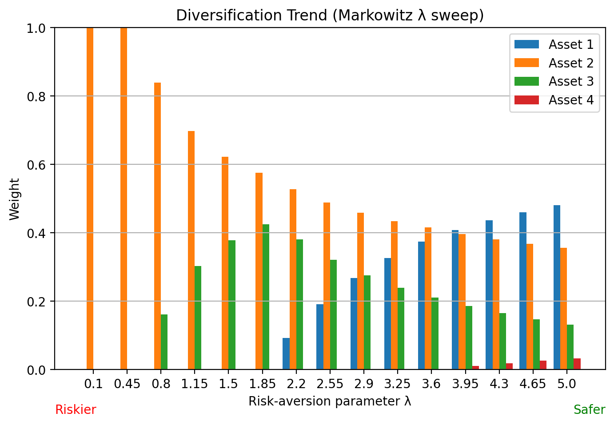

## 2. Binary (Selection) Ansatz

Example run ($n=4$, $K=2$, $λ=1.0$):
- Most probable bitstring: `|0101⟩`
- Portfolio decoded: Asset 2 and Asset 4 selected

**Circuit**:

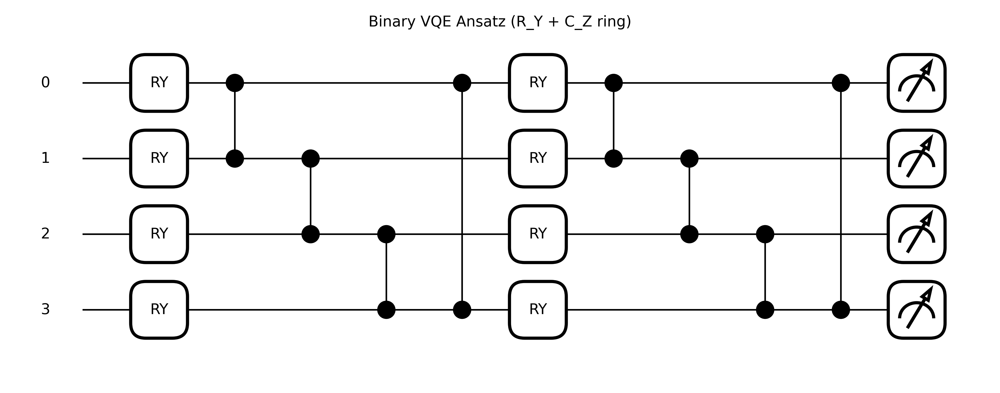

**Convergence (iterations vs energy)**:

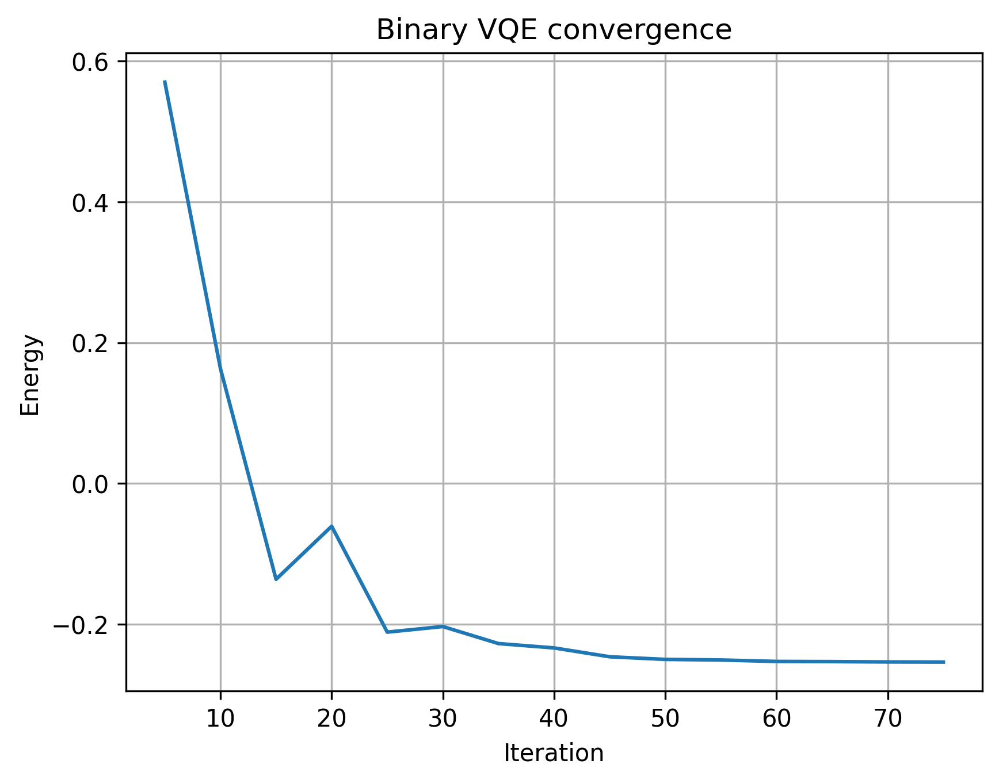

**Sampled Bitstrings (Dirac notation)**:

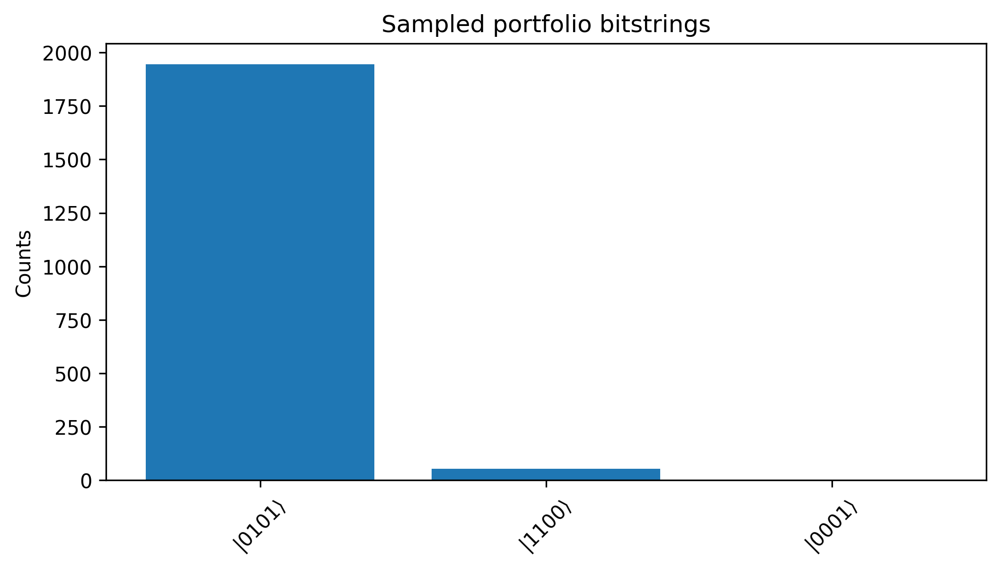

**Marginal Inclusion Probabilities**:

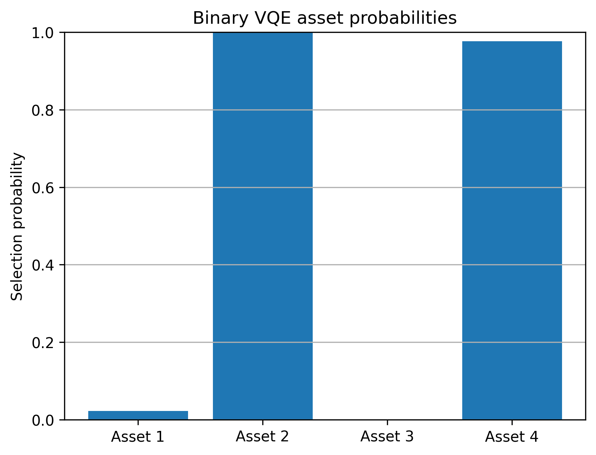

## 3. Fractional Ansatz

Example run ($n=4$, $λ=0.5$):
  ```
  Asset 1: 0.00%
  Asset 2: 99.92%
  Asset 3: 0.07%
  Asset 4: 0.01%
  ```

**Circuit**:

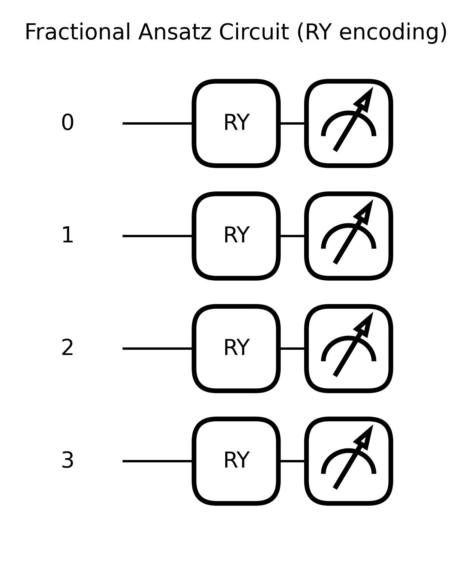

**Convergence (iterations vs energy)**:


**Allocation (Pie)**:

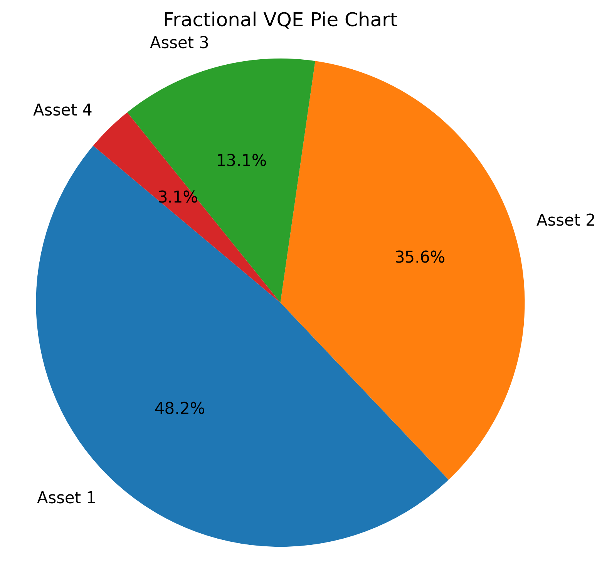

**Marginal Probabilities**:

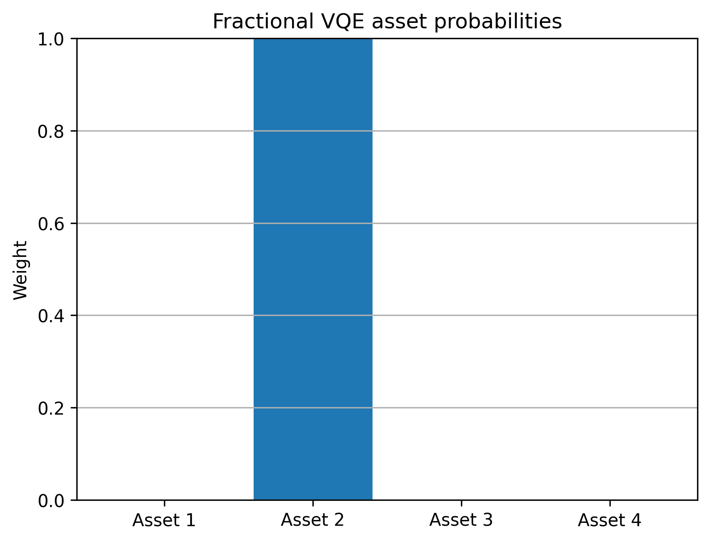

## 4. Real Data Example

Example run (AAPL, MSFT, GOOGL, AMZN; $λ=0.5$):
```
AAPL: 0.00%
MSFT: 0.01%
GOOGL: 0.01%
AMZN: 99.98%
```

**Convergence (iterations vs energy)**:

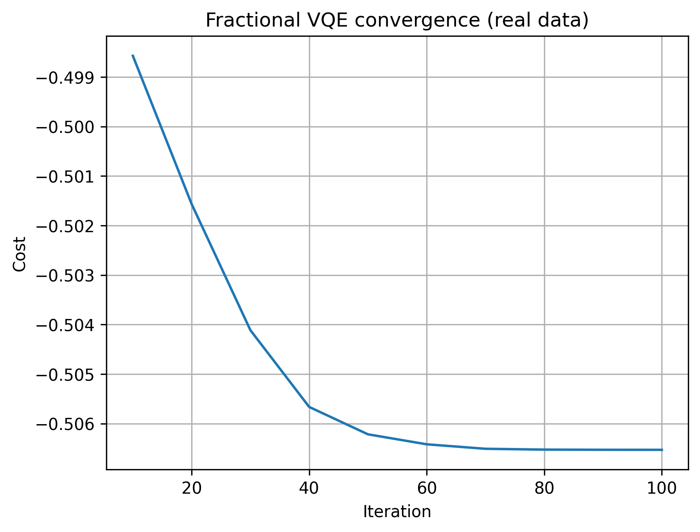

**Allocation (Pie)**:

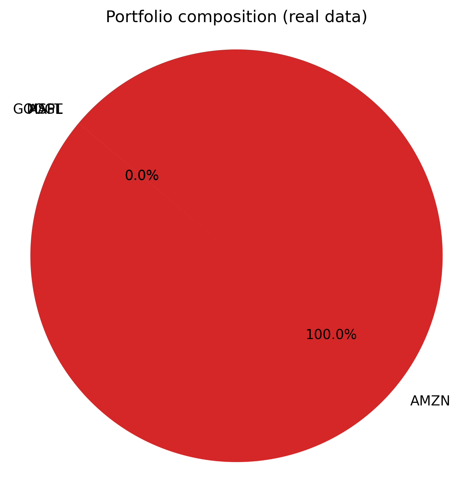

**Marginal Probabilities**:

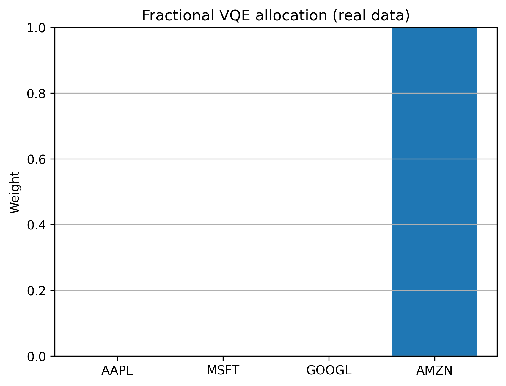

## Comparative Observations

- **Binary QUBO**: enforces discrete picks; slower and noisier convergence.  
- **Fractional VQE**: lighter, faster; suitable for fractional allocation.  
- **Classical baseline**: Markowitz solution closely matches Fractional VQE.

---

📘 Author: Sid Richards ([@SidRichardsQuantum](https://www.linkedin.com/in/sid-richards-21374b30b/))

MIT License – see [LICENSE](LICENSE) for details.
